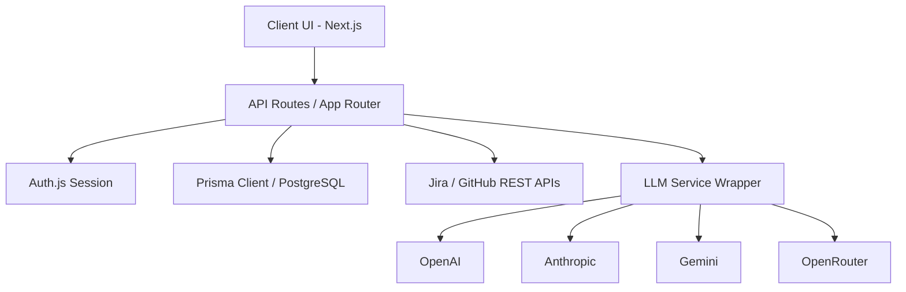
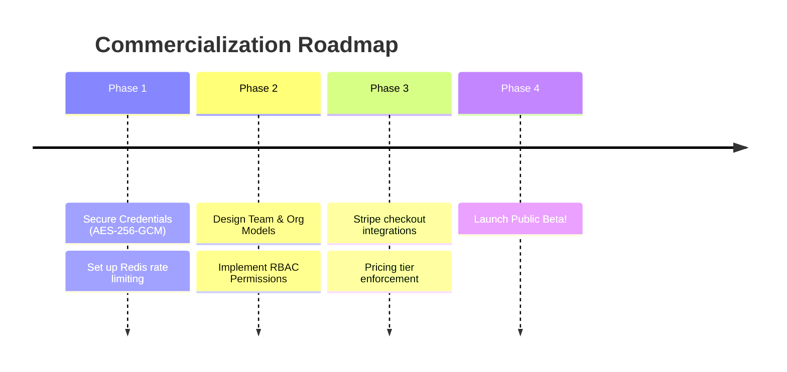

# QA Copilot — Product Rating & Launch Readiness Evaluation

This document presents a structured rating and assessment of the QA Copilot application, outlining its feature depth, technical completeness, and readiness for a commercial market launch.

---

## 📊 Summary Scorecard

| Dimension | Rating | Key Highlights |
| :--- | :---: | :--- |
| **Core AI Generation Features** | **9.5/10** | Multipurpose generators (Bugs, Cases, Gherkin) with strict Zod structured outputs. |
| **Integrations & Sync Pipelines** | **8.5/10** | 1-Click push to GitHub/Jira and on-demand Jira issue fetching for Gherkin. |
| **Heuristics & AI Intelligence** | **9.0/10** | Custom Jaccard similarity for duplicate bugs, release risk scoring, and severity recommendations. |
| **Codebase Architecture & Tech Stack** | **9.0/10** | Clean Next.js App Router setup, PostgreSQL + Prisma, robust Pino logging, multi-provider LLM wrappers. |
| **Testing & Stability Scaffolding** | **8.5/10** | 100% pass rate on unit/integration suites. E2E Playwright tests ready for setup. |
| **Security & Production Safety** | **6.5/10** | In-memory rate-limiter, plain-text integration tokens, and missing forgot-password flows. |
| **Commercialization & Billing** | **4.0/10** | Basic database quotas exist, but team workspaces, RBAC, and Stripe billing are missing. |
| **OVERALL SAAS SCORE** | **7.9/10** | **Ready for Private Beta / Technical Preview.** Needs hardening and subscription engines for public launch. |

---

## 🛠️ Feature Evaluation

### 1. AI Generation Suites — **Grade: 9.5/10**
- **Bug Report Generator**: Extremely strong. Converts raw tester notes into professional, reproducible defect reports.
- **Test Case Generator**: Generates comprehensive test case lists with positive, negative, and edge scenarios from simple requirements.
- **Acceptance Criteria (Gherkin) Generator**: Brand-new feature. Integrates manual user narratives and fetched Jira story details to write Given/When/Then scenarios.
- **Structured Schema Enforcement**: A major highlight. The custom `generateStructuredOutput` wrapper enforces Zod parsing, eliminating UI breakage from unexpected JSON shapes.

### 2. Direct Sync Integrations — **Grade: 8.5/10**
- **Jira & GitHub Push**: Enables 1-click sync of bug reports to external repositories and ticket boards.
- **Jira Issue Fetching**: Programmatically calls Jira REST APIs to extract summary & description metadata for criteria generation.
- **Credential Masking**: Seamless UI masks (e.g. `ghp_••••`) prevent raw access token disclosure.

### 3. QA Intelligence Engine — **Grade: 9.0/10**
- **Duplicate Bug Detection**: Leverages tokenized set comparison (Jaccard similarity index) to flag potential duplicates.
- **Release Risk Profiler**: Dynamically aggregates bug counts, severities, and coverage gaps to score overall build readiness.
- **Severity Inference**: Compares current issue metadata with historic reports to recommend severity adjustments.

---

## 🏗️ Architectural Quality & Tech Stack

The architecture is built on a highly performant stack:
- **Next.js App Router (V15)**: Fast, dynamic routes with server-side layout composition.
- **Tailored UI Aesthetics**: Premium vanilla CSS styling utilizing Outfit/Inter fonts, custom CSS variables, Glassmorphism, and responsive CSS grids. No generic Tailwind code.
- **Prisma & PostgreSQL**: Robust data layer with relational integrity, cascade-deletes, and indexing on search keys.



---

## 🏁 Market Launch Readiness Assessment

### 🟢 What is Launch-Ready (Beta Eligible)
1. **Core Value Prop**: AI-assisted document generation saves manual testers up to 80% of their reporting time.
2. **System Health**: Fast builds, complete typechecks, and 100% passing unit & integration tests.
3. **Auditability**: Complete `GenerationLog` tracking records prompt details, input/output tokens, and generation status.

### 🔴 Critical Blockers for Commercial Launch (Production-Ready)
Before opening the platform for public sign-ups and commercial payments, the following areas must be addressed:

```
┌────────────────────────────────────────────────────────┐
│              COMMERCIAL LAUNCH BLOCKERS                │
├───────────────┬────────────────────────┬───────────────┤
│ Security      │ Rate Limiting          │ In-memory Map │
│               │ Token Storage          │ Plain text DB │
├───────────────┼────────────────────────┼───────────────┤
│ Monetization  │ Billing System         │ No Stripe     │
│               │ Team Workspace & RBAC  │ Single-user   │
└───────────────┴────────────────────────┴───────────────┘
```

1. **Distributed Rate Limiting**:
   - **Current State**: The rate-limiter uses an in-memory JS `Map`.
   - **Launch Risk**: Fails in serverless environments (Vercel) since memory isn't shared across Lambdas. Highly vulnerable to brute-force attacks and DDoS.
   - **Required Fix**: Replace with Redis-backed rate limiting (e.g. `@upstash/ratelimit`).
2. **Credential Security**:
   - **Current State**: Integration tokens (Jira/GitHub) are stored in plaintext.
   - **Launch Risk**: High exposure. If the DB is compromised, user tokens are fully exposed.
   - **Required Fix**: Encrypt API keys at rest using AES-256-GCM.
3. **Multi-Tenancy & RBAC**:
   - **Current State**: Users own projects, but there is no mechanism for team workspaces, organization invites, or permission roles (Viewer vs. Editor).
   - **Required Fix**: Update DB schema with Organization model and membership joining tables.
4. **Stripe Billing Integration**:
   - **Current State**: Database limits are statically configured on the User table.
   - **Required Fix**: Integrate Stripe webhooks and subscription plans to monetize usage tiers.

---

## 📈 Strategic Roadmap to Launch



---

## 🎯 Verdict
QA Copilot has an **outstanding technical core**. The AI structured generation and direct tool exports work flawlessly and feel incredibly slick. It is fully ready for a **Private Alpha / Technical Preview**. 

By securing credential storage, swapping to a distributed rate-limiter, and implementing Stripe billing/teams, this product will be 100% ready to capture the growing AI-driven test management market.
